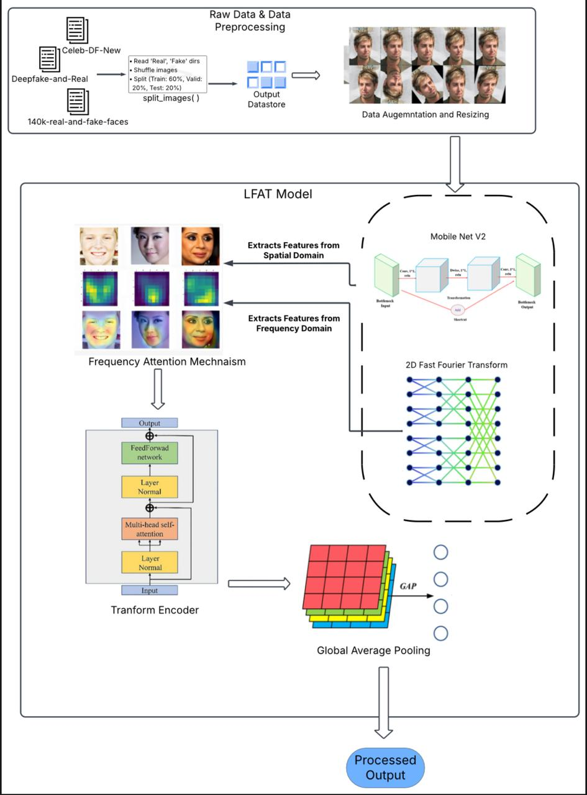
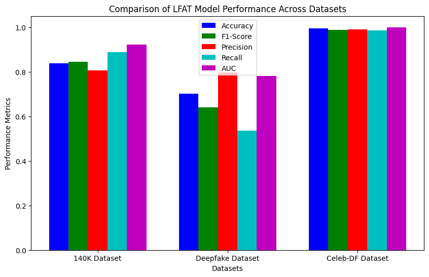
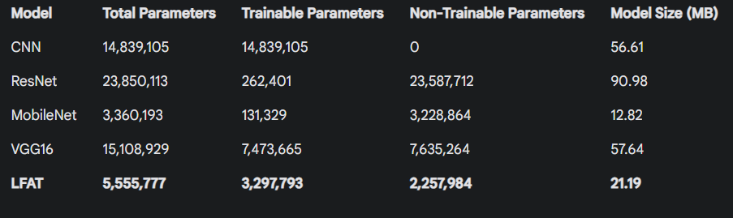
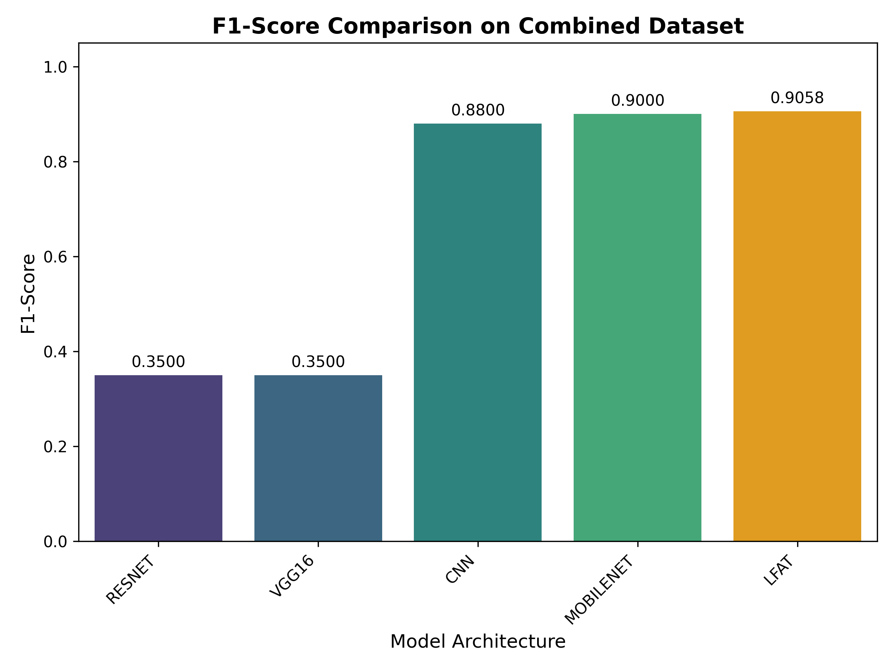
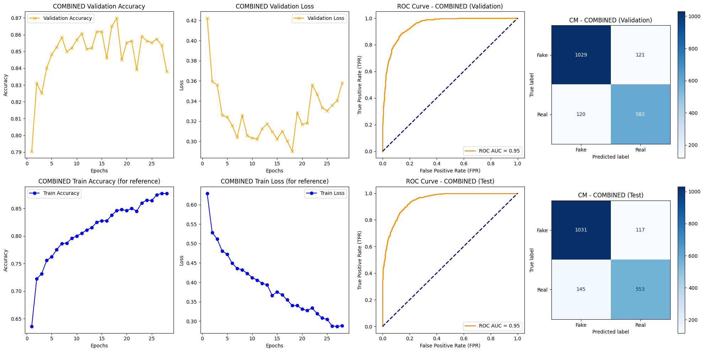

# LFAT: Deepfake Detection using Frequency-Aware Lightweight Transformer

## Overview
This repository presents the implementation of **LFAT (Frequency-Aware Lightweight Transformer)**, a deepfake detection framework designed to achieve strong cross-dataset generalization while remaining computationally efficient.

The proposed approach integrates **frequency-domain representations** with a **lightweight attention-based transformer architecture**, addressing the limitations of conventional CNN-based deepfake detection models that tend to overfit spatial artifacts.

The primary objective of this project is to develop a **robust, efficient, and deployable deepfake detection system** suitable for real-world applications.

---

## Motivation
Recent advancements in generative models have enabled the creation of highly realistic deepfake media, making traditional visual artifact-based detection approaches increasingly unreliable. Conventional CNN-based methods often:
- Overfit spatial features
- Fail to generalize across datasets
- Require heavy computational resources

This project addresses these challenges by:
- Leveraging **frequency-domain information** to capture manipulation artifacts
- Employing a **lightweight transformer-based attention mechanism**
- Balancing **detection performance and computational efficiency**

---

## Methodology
The LFAT framework consists of the following key components:

### Frequency-Domain Feature Extraction
Input facial frames are transformed into the frequency domain to highlight manipulation traces that are less apparent in the spatial domain.

### Lightweight CNN Backbone
A **MobileNet-based backbone** is used for efficient spatial feature extraction while maintaining a low computational footprint.

### Attention / Transformer Module
A transformer-based attention mechanism refines extracted features by modeling long-range dependencies and improving robustness against overfitting.

### Binary Classification Head
The refined feature representations are used to classify inputs as **Real** or **Fake**.

---

## Architecture Overview
The following diagram illustrates the complete LFAT pipeline.

---

## Datasets
The model has been evaluated on widely used deepfake benchmarks:
- Celeb-DF
- DFDC (subset)
- FaceForensics++
- 140K Real and Fake Faces Dataset

Datasets are **not included** due to licensing and size constraints.

---

## Evaluation Metrics
Performance is evaluated using:
- Accuracy
- Precision
- Recall
- F1-score
- AUC-ROC
- Model size and parameter count

---

## Results
LFAT demonstrates:
- Improved **cross-dataset generalization**
- Strong performance with **lightweight architecture**
- Suitability for real-world and edge deployment

### Model Complexity Comparison

### Model Size Comparison

### Performance Comparison (F1-score)

### ROC Curve (Combined Dataset)

---

## Project Structure
LFAT-Deepfake-Detection/
│
├── notebooks/
│ └── lfat_training_evaluation.ipynb
│
├── models/
│ └── lfat_best_model.h5
│
├── results/
│ ├── metrics.txt
│ └── evaluation_plots/
│
├── assets/
│ ├── lfat_architecture.png
│ ├── model_comparison.png
│ ├── model_size_comparison.png
│ ├── roc_combined.png
│ └── f1_comparison.png
│
├── requirements.txt
└── README.md

---

## How to Run

### Install Dependencies

pip install -r requirements.txt

### Run Training and Evaluation
Open the notebook:
notebooks/lfat_training_evaluation.ipynb

Ensure datasets are configured before execution.

---

## Limitations
- No temporal video-level modeling
- Dataset-dependent performance
- Not intended for forensic or legal decisions

---

## Related Publication
This project is associated with the manuscript:

**“Deepfake Detection using Frequency-Aware Lightweight Transformer (LFAT) Model”**

Submitted to peer-reviewed journals (Springer / Elsevier).  
Currently under review.

---

## Future Work
- Temporal modeling for video-level detection
- Explainable AI integration
- Multimodal audio-visual fusion
- Robustness to adversarial attacks

---

## Author
**Adhiswauran V**  
B.Tech (Computer Science / Artificial Intelligence)
